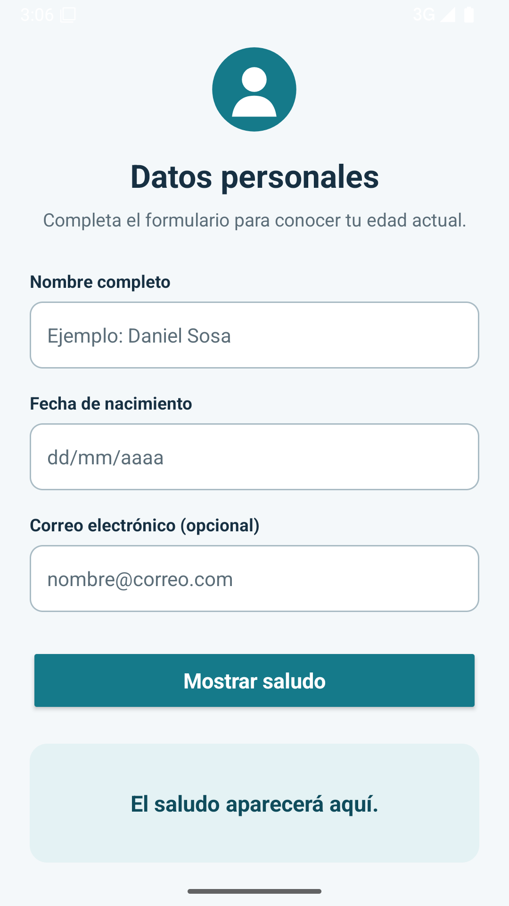
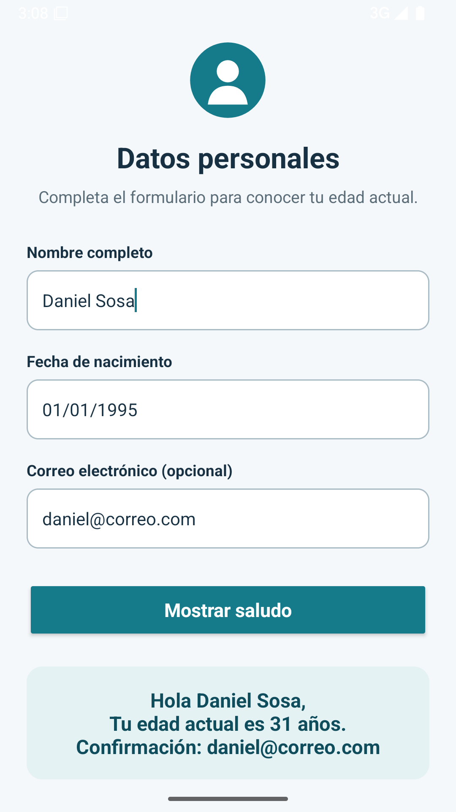

## Abrir y ejecutar

1. Abrir la carpeta del proyecto en Android Studio.
2. Esperar a que Gradle termine la sincronización.
3. Seleccionar un emulador o dispositivo con Android 8.0 o superior.
4. Ejecutar el módulo `app`.

## Evidencia

### Formulario

### Resultado

la guía visual completa está disponible en
[`docs/guia1kotlin.docx`](docs/guia1kotlin.docx).
